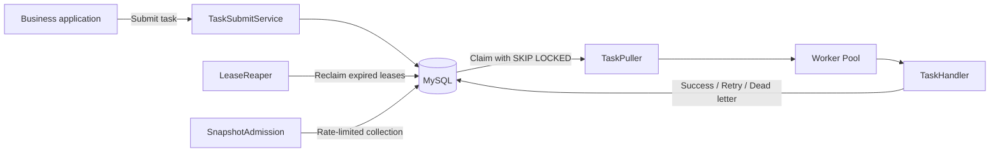
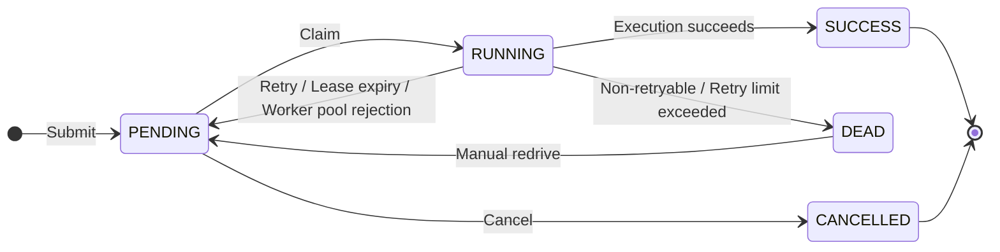

<div align="center">

# RelayQ

[简体中文](README.md) | **English**

### A lightweight, MySQL-backed durable task queue and scheduling core

Delayed execution, retries, dead-letter redrive, multi-instance task claiming, and diagnostic snapshots for Spring Boot applications.

<p>
  
  
  
  
</p>

**Only MySQL required · Horizontal scaling · Ready-to-use Spring Boot Starter**

[Quick start](#-quick-start) · [Integration guide](#-spring-boot-integration) · [Configuration](#-common-configuration)

**0.1.0 release notes:** [中文](docs/releases/0.1.0.zh-CN.md) · [English](docs/releases/0.1.0.en.md)

</div>

---

> [!IMPORTANT]
> RelayQ provides **at-least-once** execution semantics. Leases, renewals, and fencing prevent an old worker that has lost its lease from overwriting platform state, but cannot eliminate every window for duplicate business side effects. Task handlers must therefore be idempotent.

## ✨ Core Features

| | Feature | Description |
| :---: | --- | --- |
| 🪶 | **Minimal dependencies** | Only MySQL 8; no additional Redis or message broker deployment required |
| ⚡ | **Concurrent claiming** | `SELECT ... FOR UPDATE SKIP LOCKED` for safe consumption across multiple instances |
| 🕒 | **Flexible scheduling** | Immediate execution, absolute scheduled times, and relative delays |
| 🛡️ | **Reliable execution** | Idempotent submission, lease renewal, expired-task reclamation, and terminal-state fencing |
| 🔁 | **Failure handling** | Exponential backoff, jitter, error classification, dead letters, and manual redrive |
| 🚦 | **Load protection** | Bounded worker queues, batch requeueing, and graceful shutdown |
| 📸 | **Diagnostic snapshots** | Automatic or manual collection of thread dumps, thread pool utilization, heap usage, and backlog counts |
| 📈 | **Observability** | Micrometer metrics, Prometheus exposition, and propagated `traceId` |

## 🧭 Contents

- [How it works](#-how-it-works)
- [Quick start](#-quick-start)
- [Spring Boot integration](#-spring-boot-integration)
- [Example management API](#-example-management-api)
- [Common configuration](#-common-configuration)
- [Observability](#-observability)
- [Project structure](#-project-structure)
- [Build and test](#-build-and-test)
- [Capacity test report](#-capacity-test-report)
- [Semantics and known limitations](#-semantics-and-known-limitations)

## 🏗️ How It Works



### Task State Transitions



## 🚀 Quick Start

### Prerequisites

- Docker and Docker Compose
- JDK 21 and Maven 3.9+ for local builds

### 1. Start the Two-Instance Example

The Compose configuration starts MySQL 8.0 with GTID-based primary/replica replication and two RelayQ instances sharing the primary database:

```bash
docker compose up --build -d
docker compose ps
```

| Service | Address | Description |
| --- | --- | --- |
| `relayq-app-1` | <http://localhost:8081> | Example application instance 1 |
| `relayq-app-2` | <http://localhost:8082> | Example application instance 2 |
| `mysql-master` | `localhost:3306` | Primary database `relayq`; username and password are both `relayq` |
| `mysql-slave` | `localhost:3307` | Read-only replica using ROW binlogs and GTID replication |

### 2. Check Application Health

```bash
curl http://localhost:8081/actuator/health
curl http://localhost:8082/actuator/health
```

### 3. Submit an Echo Task

```bash
curl -i -X POST http://localhost:8081/api/tasks \
  -H "Content-Type: application/json" \
  -d '{
    "biz_key": "readme-echo-001",
    "handler_name": "echo-handler",
    "params": {
      "message": "Hello, RelayQ!"
    }
  }'
```

### 4. Query the Task and Observe Execution

```bash
curl http://localhost:8081/api/tasks/by-biz-key/readme-echo-001
docker compose logs -f relayq-app-1 relayq-app-2
```

Submitting the same `biz_key` again returns the existing task instead of creating a duplicate record.

<details>
<summary><strong>Stop or reset the local environment</strong></summary>

Stop services while retaining MySQL data:

```bash
docker compose down
```

Stop services and delete local task data:

```bash
docker compose down -v
```

</details>

## 🔌 Spring Boot Integration

Version `0.1.0` is available on Maven Central. Add the dependency below directly; a local build and install is not required.

### 1. Add the Starter

```xml
<dependency>
    <groupId>io.github.suanla</groupId>
    <artifactId>relayq-spring-boot-starter</artifactId>
    <version>0.1.0</version>
</dependency>
```

### 2. Initialize the Database

Run [`schema.sql`](relayq-core/src/main/resources/db/schema.sql) against your target MySQL 8 database. This file is the authoritative schema definition. The Starter does not create tables automatically.

### 3. Configure the Data Source and RelayQ

```yaml
spring:
  datasource:
    url: jdbc:mysql://localhost:3306/relayq?connectionTimeZone=%2B08:00&forceConnectionTimeZoneToSession=true
    username: relayq
    password: relayq
    hikari:
      maximum-pool-size: 40

relayq:
  enabled: true
  instance-id: ${HOSTNAME:relayq-local}
  pull:
    interval-ms: 1000
    batch-size: 100
  worker:
    core-size: 8
    max-size: 32
    queue-capacity: 1000
  lease:
    ttl-seconds: 30
  retry:
    default-max-retry: 3
  handler:
    timeout-ms: 30000
```

> [!TIP]
> Each instance must have a unique `relayq.instance-id` in a multi-instance deployment. Worker concurrency consumes database connections. Size the connection pool to accommodate worker writes, task claiming, lease reclamation, snapshot persistence, and management requests.

### 4. Register a Handler

Implement `TaskHandler` and use `@RelayqHandler` to register it as a Spring bean with a unique handler name:

```java
import com.suanla.relayq.core.handler.RelayqHandler;
import com.suanla.relayq.core.handler.TaskContext;
import com.suanla.relayq.core.handler.TaskHandler;
@RelayqHandler("send-email")
public class SendEmailHandler implements TaskHandler {

    @Override
    public void execute(TaskContext context) {
        SendEmailParams params = context.param(SendEmailParams.class);

        // Use bizKey or a unique business key for downstream idempotency
        sendEmailIdempotently(context.getBizKey(), params);
    }
}
```

`TaskContext` exposes the task ID, business key, handler name, parameters, `traceId`, attempt number, retry count, and scheduled execution time.

### 5. Submit a Task

Inject `TaskSubmitService` to submit tasks:

```java
SubmitResult result = taskSubmitService.submit(new SubmitCommand(
        "order-20260728-confirm",
        "send-email",
        "{\"recipient\":\"user@example.com\"}",
        null,  // scheduledTime: absolute execution time
        30L,   // delaySeconds: relative delay; mutually exclusive with scheduledTime
        3      // maxRetry: null uses the global default
));
```

Submission validates that the handler is registered. `bizKey` is the submission idempotency key; it does not make the handler's business side effects idempotent.

## 🧰 Example Management API

The following HTTP endpoints are provided by `relayq-example`, not by the Starter's auto-configuration:

| Method | Path | Purpose |
| :---: | --- | --- |
| `POST` | `/api/tasks` | Submit a task |
| `GET` | `/api/tasks/{id}` | Get task details |
| `GET` | `/api/tasks?status=PENDING&page=1&size=20` | List tasks by status with pagination |
| `GET` | `/api/tasks/by-biz-key/{bizKey}` | Find a task by business key |
| `POST` | `/api/tasks/{id}/cancel` | Cancel a pending task |
| `GET` | `/api/tasks/{id}/logs` | Get execution logs |
| `GET` | `/api/tasks/{id}/snapshots` | Get diagnostic snapshots |
| `GET` | `/api/dead-letters` | List dead-letter tasks |
| `POST` | `/api/dead-letters/{id}/redrive` | Manually redrive a dead-letter task |
| `POST` | `/api/snapshots/manual` | Trigger a snapshot manually |

The submission endpoint accepts either `scheduled_time` or `delay_seconds`, but not both. The example application uses snake_case JSON fields throughout.

## ⚙️ Common Configuration

| Property | Default | Description |
| --- | ---: | --- |
| `relayq.enabled` | `true` | Enable or disable auto-configuration |
| `relayq.instance-id` | Generated automatically | Lease owner identifier |
| `relayq.pull.interval-ms` | `1000` | Base polling interval |
| `relayq.pull.batch-size` | `100` | Maximum tasks claimed per batch |
| `relayq.pull.empty-backoff-max-ms` | `30000` | Maximum backoff after consecutive empty polls |
| `relayq.worker.core-size` | `8` | Core worker count |
| `relayq.worker.max-size` | `32` | Maximum worker count |
| `relayq.worker.queue-capacity` | `1000` | Bounded worker queue capacity |
| `relayq.lease.ttl-seconds` | `30` | Task lease duration |
| `relayq.retry.default-max-retry` | `3` | Default maximum retry count |
| `relayq.handler.timeout-ms` | `30000` | Handler timeout |
| `relayq.snapshot.enabled` | `true` | Enable diagnostic snapshots |
| `relayq.snapshot.rate-per-minute` | `5` | Snapshot limit per instance per minute |

See [`application.yaml`](relayq-example/src/main/resources/application.yaml) for the full configuration and comments (Chinese).

## 📊 Observability

With Spring Boot Actuator and the appropriate Micrometer registry, RelayQ registers these core metrics:

| Category | Metrics |
| --- | --- |
| Tasks | `relayq.task.backlog`, `relayq.task.execute`, `relayq.task.rejected` |
| Polling | `relayq.pull.duration`, `relayq.pull.batch.size`, `relayq.pull.empty.ratio` |
| Thread pool | `relayq.pool.active`, `relayq.pool.queue.size`, `relayq.pool.queue.remaining` |
| Leases | `relayq.lease.reclaimed`, `relayq.lease.lost` |
| Snapshots | `relayq.snapshot` |

The example application exposes Prometheus-format metrics at <http://localhost:8081/actuator/prometheus>.

## 📦 Project Structure

```text
relayq
├── relayq-core                 # State machine, claiming, execution, leases, retries, dead letters, snapshots, and metrics
├── relayq-spring-boot-starter   # Auto-configuration, property binding, bean wiring, and lifecycle management
├── relayq-example              # Runnable example, management API, and example handlers
└── ops                         # Kubernetes manifests, MySQL initialization scripts, and sample data
```

## 🧪 Build and Test

Run the full verification:

```bash
mvn clean verify
```

Build only the example and its dependencies:

```bash
mvn -pl relayq-example -am package
```

Run the example locally:

```bash
docker compose up -d mysql-master mysql-slave mysql-replication-init
java -jar relayq-example/target/relayq-example-0.1.0.jar
```

## 📋 Capacity Test Report

A warm-state **250 QPS × 15-minute** test completed on 2026-09-07: all 225,001 submissions succeeded with no dropped iterations and an HTTP P99 of **141.95 ms**. Post-test verification by run ID confirmed that all tasks and execution audits succeeded on their first attempt and that primary/replica verification passed. The deadlock counter did not increase during observation, and application restart counts remained unchanged.

### Test Environment and Measurement Scope

| Item | Configuration for this run |
| --- | --- |
| Formal run ID | `soak-250-20260907-01` |
| Deployment | Docker Desktop Kubernetes; separate load-generator and Kubernetes machines |
| Application | 2 pods; each limited to **2 CPU / 1 GiB**, requesting 250m CPU / 512 MiB |
| Database connection pool | Hikari maximum-pool-size = **48** per application instance |
| Backlog metric cache | `RELAYQ_METRICS_BACKLOG_CACHE_SECONDS=3600` |
| MySQL primary | Configuration confirmed during this test phase: limit 4 CPU / 4 GiB, request 2 CPU / 1 GiB; GTID replica configured |
| Durability | Configuration confirmed during this test phase: `innodb_flush_log_at_trx_commit=1`, `sync_binlog=1` |
| Test endpoint | Port `18080` on the Kubernetes host's LAN address; LAN port `30080` was not used in this run |
| Load model | k6 `constant-arrival-rate`, 250 iterations/s, one task submission per iteration |
| Virtual users | 500 preallocated, maximum 500; peak active VUs during the formal run: 61 |
| Task payload | `POST /api/tasks`, unique `biz_key`, `handler_name=load-test-handler`, `params=null`, `max_retry=0` |
| Handler behavior | No-op: no external business calls, sleeps, or business processing time |

Resource settings were manually checked during this test phase and are not necessarily the repository manifest defaults. The application image digest, exact MySQL version, and total database size were not independently verified for this report; archive these separately when comparing versions. The k6 metadata records the image tag `grafana/k6:latest`, which is not a pinned version identifier.

### Test Procedure

1. Warm up at the full target rate of 250 QPS for 5 minutes, using run ID `warm-soak-250-20260907-01`. All 75,000 requests succeeded with zero dropped iterations and a P99 of 150.25 ms.
2. Keep application configuration and pods unchanged. Start evidence collection, then run the formal 15-minute test. The wrapper script recorded **2026-09-07 15:34:10–15:49:11 UTC** (23:34:10–23:49:11 China Standard Time); k6 generated load for 15 minutes.
3. Run `verify-load-run-k8s.ps1` against the actual request count of **225,001** to verify tasks, audits, and primary/replica results. The script's suggested 225,000 is the planned rate multiplied by duration; verification uses the actual recorded count.
4. Collect deadlock evidence over **15:33:16–15:51:18 UTC**, with a configured window of 1,080 seconds and a 5-second polling interval.

Warm-up and formal results are stored separately. Five minutes was the warm-up duration used here, not a guarantee that every environment stabilizes within that time. Subsequent tests should still examine latency, throughput, and task draining toward the end of warm-up.

### Formal Run Results

| Metric | Measured result |
| --- | ---: |
| HTTP requests / Successfully accepted | 225,001 / 225,001 |
| Actual HTTP throughput | 250.003452 req/s |
| HTTP failures / Failed checks | 0 / 0 |
| Dropped / Interrupted iterations | 0 / 0 |
| HTTP mean / Median latency | 43.55 ms / 36.72 ms |
| HTTP P90 / P95 / P99 | 67.09 ms / 83.32 ms / **141.95 ms** |
| Maximum HTTP latency | 2.05 s |
| k6 exit code | 0 |

The script thresholds are: check success rate > 99%, HTTP failure rate < 1%, HTTP P99 < 1,000 ms, and zero dropped iterations. All passed, with zero actual request failures. A maximum latency above one second does not violate the P99 threshold.

| Correctness and runtime status | Verification result |
| --- | --- |
| Primary task records | 225,001, all SUCCESS; retry_count = 0, current_attempt_no = 1 |
| Primary execution audits | 225,001, all SUCCESS on attempt 1, no open audits |
| Replica verification | Task and audit verification results for this run ID matched the primary; script verdict PASSED |
| Replication status | IO and SQL threads running at verification, SecondsBehind = 0, no replication errors |
| Deadlocks | Initial 0, final 0, increase 0, captured events 0 |
| Evidence collection | Empty pollFailures list |
| Application status | Both pods 1/1 Running; restart counts remained at 4, with no additional restarts |

### Evidence and Limits of the Conclusions

HTTP figures were checked against the formal run's `.json` and `.log` files and warm-up records under `ops/perf/results/` on the load-generator machine. Task, replication, deadlock, and pod status came from the operator-provided verification output for this run. The evidence directory on the Kubernetes machine is `results/soak-250-20260907-01-evidence/`.

These runtime artifacts are not required to be accessible as README links; retain them together when archiving the test. See the [capacity testing guide (Chinese)](ops/perf/README.md) for load, collection, and verification script usage.

- **This validates a warm-state, 250 QPS, 15-minute baseline for a no-op workload on two application instances, each limited to 2 CPU and 1 GiB, in this environment.** It is not a validation of the earlier 1 CPU / 1 GiB configuration, a framework capacity ceiling, or a production capacity commitment.
- HTTP P99 measures submission endpoint response time, not end-to-end time from submission to asynchronous task completion. Post-test completion and replication catch-up do not prove the absence of backlog or replication lag throughout the run.
- No faults were injected. First-attempt success and one audit per task are observations from this run; RelayQ still provides at-least-once semantics. Zero deadlocks do not replace targeted tests of expired-lease reclamation, node failures, or duplicate business side effects.
- The backlog cache TTL was 3,600 seconds, so its chart alone cannot prove zero real-time backlog throughout a 15-minute run. Changes to collection frequency, resources, images, endpoints, or task logic require another warm-up and test.

## ⚠️ Semantics and Known Limitations

- The platform provides **at-least-once**, not exactly-once; handlers must be idempotent.
- `biz_key` prevents duplicate task creation; it does not replace downstream business idempotency.
- Snapshot rate limiting is currently per process; aggregate limits scale with instance count.
- Scheduling precision depends on the database polling interval and is not suitable for sub-second scheduling.
- The current data model is not sharded; plan for archival or hot/cold data separation in long-running deployments.
- There is no management console yet; `relayq-example` provides REST APIs only.

## 📄 License

This project is released under the [Apache License 2.0](LICENSE).

---

<div align="center">

If RelayQ is useful to you, feel free to open an issue, contribute code, or give it a ⭐

</div>
