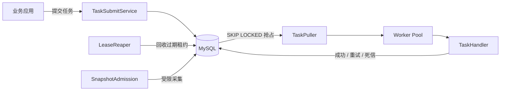
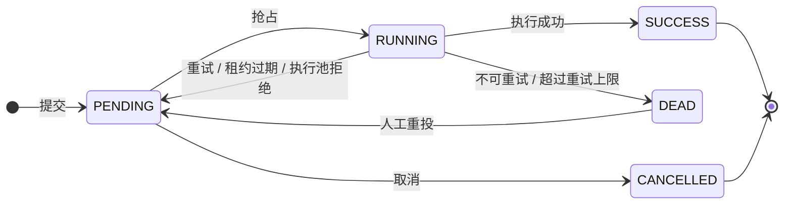

<div align="center">

# RelayQ

### 基于 MySQL 的轻量级持久化任务队列与调度内核

为 Spring Boot 应用提供延迟执行、失败重试、死信重投、多实例抢占与事故快照能力。

<p>
  
  
  
  
</p>

**只需 MySQL · 支持水平扩展 · 开箱即用的 Spring Boot Starter**

[快速开始](#-快速开始) · [接入指南](#-接入-spring-boot) · [配置参考](#-常用配置) · [架构设计](docs/architecture.md)

</div>

---

> [!IMPORTANT]
> RelayQ 提供 **at-least-once（至少一次）** 执行语义。租约、续租与 fencing 可防止失去租约的旧 Worker 覆盖平台状态，但无法完全消除业务副作用被重复执行的窗口，因此任务 Handler 必须具备幂等性。

## ✨ 核心能力

| | 能力 | 说明 |
| :---: | --- | --- |
| 🪶 | **轻量依赖** | 仅依赖 MySQL 8，无需额外部署 Redis 或消息中间件 |
| ⚡ | **并发抢占** | 基于 `SELECT ... FOR UPDATE SKIP LOCKED`，支持多实例安全消费 |
| 🕒 | **灵活调度** | 支持立即执行、指定时间执行与相对延迟执行 |
| 🛡️ | **可靠执行** | 提交幂等、租约续期、过期回收与终态 fencing |
| 🔁 | **失败治理** | 指数退避、随机抖动、错误分类、死信与人工重投 |
| 🚦 | **流量保护** | 有界 Worker 队列、批量回置与优雅停机 |
| 📸 | **事故快照** | 自动或手动采集线程 Dump、线程池水位、堆内存与积压量 |
| 📈 | **可观测性** | Micrometer 指标、Prometheus 暴露与全链路 `traceId` |

## 🧭 目录

- [工作原理](#-工作原理)
- [快速开始](#-快速开始)
- [接入 Spring Boot](#-接入-spring-boot)
- [示例管理 API](#-示例管理-api)
- [常用配置](#-常用配置)
- [可观测性](#-可观测性)
- [项目结构](#-项目结构)
- [构建与测试](#-构建与测试)
- [语义边界与已知限制](#-语义边界与已知限制)

## 🏗️ 工作原理



### 任务状态流转



## 🚀 快速开始

### 环境要求

- Docker 与 Docker Compose
- 本地构建需要 JDK 21 与 Maven 3.9+

### 1. 启动双实例示例

仓库内的 Compose 配置会启动 MySQL 8.4，以及两个共享同一任务库的 RelayQ 实例：

```bash
docker compose up --build -d
docker compose ps
```

| 服务 | 地址 | 说明 |
| --- | --- | --- |
| `relayq-app-1` | <http://localhost:8081> | 示例应用实例 1 |
| `relayq-app-2` | <http://localhost:8082> | 示例应用实例 2 |
| `mysql` | `localhost:3306` | 数据库 `relayq`，用户名与密码均为 `relayq` |

### 2. 检查应用状态

```bash
curl http://localhost:8081/actuator/health
curl http://localhost:8082/actuator/health
```

### 3. 提交一个 Echo 任务

```bash
curl -i -X POST http://localhost:8081/api/tasks \
  -H "Content-Type: application/json" \
  -d '{
    "biz_key": "readme-echo-001",
    "handler_name": "echo-handler",
    "params": {
      "message": "Hello, RelayQ!"
    }
  }'
```

### 4. 查询并观察任务执行

```bash
curl http://localhost:8081/api/tasks/by-biz-key/readme-echo-001
docker compose logs -f relayq-app-1 relayq-app-2
```

使用相同的 `biz_key` 再次提交时，RelayQ 会返回已有任务，不会创建重复记录。

<details>
<summary><strong>停止或重置本地环境</strong></summary>

停止服务并保留 MySQL 数据：

```bash
docker compose down
```

停止服务并清空本地任务数据：

```bash
docker compose down -v
```

</details>

## 🔌 接入 Spring Boot

当前项目版本为 `0.0.1-SNAPSHOT`。在发布到制品仓库前，先在源码根目录执行：

```bash
mvn clean install
```

### 1. 引入 Starter

```xml
<dependency>
    <groupId>com.suanla</groupId>
    <artifactId>relayq-spring-boot-starter</artifactId>
    <version>0.0.1-SNAPSHOT</version>
</dependency>
```

### 2. 初始化数据库

在目标 MySQL 8 数据库执行 [`schema.sql`](relayq-core/src/main/resources/db/schema.sql)。该文件是项目表结构的唯一权威定义，Starter 不会自动建表。

### 3. 配置数据源与 RelayQ

```yaml
spring:
  datasource:
    url: jdbc:mysql://localhost:3306/relayq?connectionTimeZone=%2B08:00&forceConnectionTimeZoneToSession=true
    username: relayq
    password: relayq
    hikari:
      maximum-pool-size: 40

relayq:
  enabled: true
  instance-id: ${HOSTNAME:relayq-local}
  pull:
    interval-ms: 1000
    batch-size: 100
  worker:
    core-size: 8
    max-size: 32
    queue-capacity: 1000
  lease:
    ttl-seconds: 30
  retry:
    default-max-retry: 3
  handler:
    timeout-ms: 30000
```

> [!TIP]
> 多实例部署时，每个实例的 `relayq.instance-id` 必须不同。Worker 并发会占用数据库连接，连接池容量应同时覆盖 Worker 写入、拉取、租约回收、快照落库和管理请求。

### 4. 注册 Handler

实现 `TaskHandler`，将其注册为 Spring Bean，并通过 `@RelayqHandler` 声明唯一名称：

```java
import com.suanla.relayq.core.handler.RelayqHandler;
import com.suanla.relayq.core.handler.TaskContext;
import com.suanla.relayq.core.handler.TaskHandler;
import org.springframework.stereotype.Component;

@Component
@RelayqHandler("send-email")
public class SendEmailHandler implements TaskHandler {

    @Override
    public void execute(TaskContext context) {
        SendEmailParams params = context.param(SendEmailParams.class);

        // 使用 bizKey 或业务唯一键保证下游操作幂等
        sendEmailIdempotently(context.getBizKey(), params);
    }
}
```

`TaskContext` 提供任务 ID、业务键、Handler 名称、参数、`traceId`、尝试次数、重试次数和计划执行时间等上下文。

### 5. 提交任务

注入 `TaskSubmitService` 后即可提交任务：

```java
SubmitResult result = taskSubmitService.submit(new SubmitCommand(
        "order-20260728-confirm",
        "send-email",
        "{\"recipient\":\"user@example.com\"}",
        null,  // scheduledTime：绝对执行时间
        30L,   // delaySeconds：相对延迟；不能与 scheduledTime 同时设置
        3      // maxRetry；为 null 时使用全局默认值
));
```

提交时会校验 Handler 是否已注册。`bizKey` 是提交幂等键，但不等同于 Handler 业务副作用幂等。

## 🧰 示例管理 API

以下 HTTP 接口由 `relayq-example` 提供，不属于 Starter 的自动配置接口：

| 方法 | 路径 | 用途 |
| :---: | --- | --- |
| `POST` | `/api/tasks` | 提交任务 |
| `GET` | `/api/tasks/{id}` | 查询任务详情 |
| `GET` | `/api/tasks?status=PENDING&page=1&size=20` | 按状态分页查询 |
| `GET` | `/api/tasks/by-biz-key/{bizKey}` | 按业务键查询 |
| `POST` | `/api/tasks/{id}/cancel` | 取消待执行任务 |
| `GET` | `/api/tasks/{id}/logs` | 查询执行记录 |
| `GET` | `/api/tasks/{id}/snapshots` | 查询事故快照 |
| `GET` | `/api/dead-letters` | 查询死信任务 |
| `POST` | `/api/dead-letters/{id}/redrive` | 人工重投死信 |
| `POST` | `/api/snapshots/manual` | 手动触发快照 |

提交接口支持 `scheduled_time` 或 `delay_seconds`，两者不能同时设置。示例应用统一使用 snake_case JSON 字段。

## ⚙️ 常用配置

| 配置项 | 默认值 | 说明 |
| --- | ---: | --- |
| `relayq.enabled` | `true` | 自动配置总开关 |
| `relayq.instance-id` | 自动生成 | 租约持有者标识 |
| `relayq.pull.interval-ms` | `1000` | 基础轮询间隔 |
| `relayq.pull.batch-size` | `100` | 单次最大抢占量 |
| `relayq.pull.empty-backoff-max-ms` | `30000` | 连续空拉最大退避时间 |
| `relayq.worker.core-size` | `8` | 常驻 Worker 数 |
| `relayq.worker.max-size` | `32` | 最大 Worker 数 |
| `relayq.worker.queue-capacity` | `1000` | Worker 有界队列容量 |
| `relayq.lease.ttl-seconds` | `30` | 任务租约有效期 |
| `relayq.retry.default-max-retry` | `3` | 默认最大重试次数 |
| `relayq.handler.timeout-ms` | `30000` | Handler 超时时间 |
| `relayq.snapshot.enabled` | `true` | 是否启用事故快照 |
| `relayq.snapshot.rate-per-minute` | `5` | 单实例每分钟快照上限 |

完整配置及注释见 [`application.yaml`](relayq-example/src/main/resources/application.yaml)。

## 📊 可观测性

引入 Spring Boot Actuator 与对应的 Micrometer Registry 后，RelayQ 会注册以下核心指标：

| 类别 | 指标 |
| --- | --- |
| 任务 | `relayq.task.backlog`、`relayq.task.execute`、`relayq.task.rejected` |
| 拉取 | `relayq.pull.duration`、`relayq.pull.batch.size`、`relayq.pull.empty.ratio` |
| 线程池 | `relayq.pool.active`、`relayq.pool.queue.size`、`relayq.pool.queue.remaining` |
| 租约 | `relayq.lease.reclaimed`、`relayq.lease.lost` |
| 快照 | `relayq.snapshot` |

示例应用通过 <http://localhost:8081/actuator/prometheus> 暴露 Prometheus 格式指标。

## 📦 项目结构

```text
relayq
├── relayq-core                 # 状态机、抢占执行、租约、重试、死信、快照与指标
├── relayq-spring-boot-starter  # 自动配置、属性绑定、Bean 装配与生命周期管理
├── relayq-example              # 可运行示例、管理 API 与示例 Handler
└── docs                        # 架构决策与实现约束
```

## 🧪 构建与测试

运行完整验证：

```bash
mvn clean verify
```

只构建示例及其依赖：

```bash
mvn -pl relayq-example -am package
```

本地运行示例：

```bash
docker compose up -d mysql
java -jar relayq-example/target/relayq-example-0.0.1-SNAPSHOT.jar
```

## ⚠️ 语义边界与已知限制

- 平台保证 **at-least-once**，不保证 exactly-once；Handler 必须幂等。
- `biz_key` 只避免重复创建任务，不能替代下游业务幂等。
- 快照限流目前是单进程级，多实例总量会随实例数增长。
- 延迟精度受数据库轮询间隔影响，不适合亚秒级定时。
- 当前数据模型未分片，长期运行时需要规划归档或冷热分离。
- 项目暂不包含管理控制台，`relayq-example` 仅提供 REST API。

更多设计细节、并发边界与技术取舍请阅读 [架构设计文档](docs/architecture.md)。

## 📄 License

本项目基于 [Apache License 2.0](LICENSE) 开源。

---

<div align="center">

如果 RelayQ 对你有帮助，欢迎提交 Issue、贡献代码，或点亮一个 ⭐

</div>
